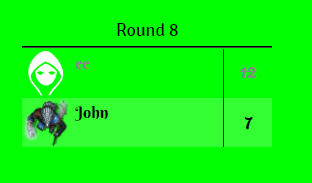
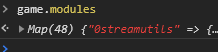
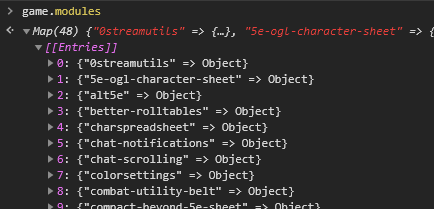
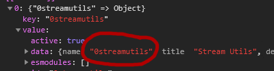

# VTT StreamUtils

This module adds extra and custom overlays to the /stream page of Foundry VTT and also allows you to disable modules on the /stream page.

## Installation

To install, import this [Manifest](https://raw.githubusercontent.com/ardittristan/VTTStreamUtils/master/module.json) into your module browser.

## Usage

### HP Overlay

1. Select the actors you want to show up in the module settings.
2. Set the path to the hp value and max hp value in the module settings.
3. Now it should show the hp for the selected actors on /stream.

### Combat Tracker Overlay

* This one doesn't require any setup.

### Last Roll Overlay

* This one doesn't require any setup.

### Custom Overlay

It is possible to create custom overlays, while this does require some knowledge of JSON, more info about this in these [examples](https://github.com/ardittristan/VTTStreamUtils/blob/master/docs/example.md).

### Modules causing issues

Sometimes modules don't play well with the /stream view, you can disable them by adding their identifier name to the disable setting. This setting only disables them on the /stream page

How to find the module identifier

To get the id of a module, press `F12` and open the console tab. Then in the console tab, type `game.modules`, a map object should appear:  
  
If you click on the arrow it should expand to a list:  
  
The names in this list are the module identifiers, if you have no idea what module corresponds to a module idea, you can open it and find the name in it's data:  

## Changelog

Check the [Changelog](https://github.com/ardittristan/VTTStreamUtils/blob/master/CHANGELOG.md)

## Feature Requests

If there's an overlay you want that can't simply be done with the custom overlay, feel free to create a feature request!
