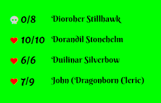

# VTT StreamUtils

This module adds extra and custom overlays to the /stream page of Foundry VTT.

## Installation

To install, import this [Manifest](https://raw.githubusercontent.com/ardittristan/VTTStreamUtils/master/module.json) into your module browser.

## Usage

### HP Overlay

1. Select the actors you want to show up in the module settings.
2. Set the path to the hp value and max hp value in the module settings.
3. Now it should show the hp for the selected actors on /stream.

### Custom Overlay

It is possible to create custom overlays, while this does require some knowledge of JSON, more info about this in these [examples](https://github.com/ardittristan/VTTStreamUtils/blob/master/docs/example.md).

## Changelog

Check the [Changelog](https://github.com/ardittristan/VTTStreamUtils/blob/master/CHANGELOG.md)

## Feature Requests

If there's an overlay you want that can't simply be done with the custom overlay, feel free to create a feature request!
