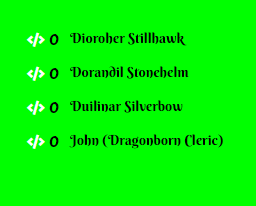
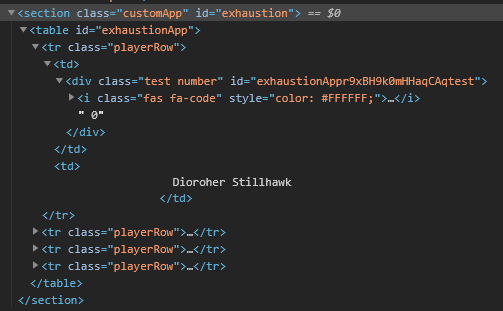
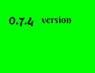
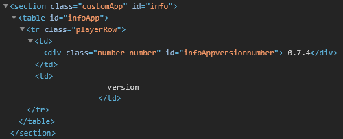
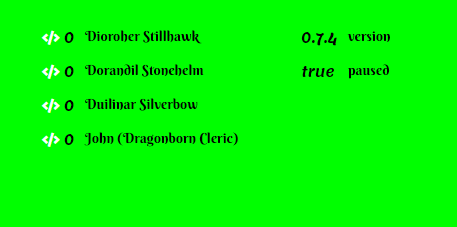

# Help

There is 2 kinds of objects you can use in the array, objects that use the actor list you set in settings, or objects that are fully custom.
You can put those objects under each other separate from each other by commas in the array (an array is between [ ]). You can add as many objects to each array as you want.

## The 2 Objects

In both objects the `icon` and `iconColor` properties are optional.

### Actor List

* If `actorList` is true or not defined the actor list will be used for the row names.
* `id` is used for giving the overlay a html id that can be used for css selection.
* The `data` array is the list of data that gets shown next to the actor name.
* The `path` property is the path to the variable you want to show, you can get this path by opening the console (f12), typing `game.actors` and then opening any actor and it's value. The properties you open from here on are what you use in the `path` property separated by dots.
* The `name` property is used to set the class of the number in html to be used for css selection.
* `icon` and `iconColor` add an icon to the value and set the icon's color.

#### Example List

```json
[
  {
    "id": "exhaustion",
    "actorList": true,
    "data": [
      {
        "name": "test",
        "icon": "fas fa-code",
        "iconColor": "#FFFFFF",
        "path": "data.data.attributes.exhaustion"
      }
    ]
  }
]
```

Creates the view:  


And the html:  


### Custom Objects

* If `actorList` is false a custom overlay will be created.
* `id` is used for giving the overlay a html id that can be used for css selection.
* The `data` array is the list of rows you want to appear in the overlay.
* The `rowName` property is what shows up as the name of the row.
* The `rowData` array contains the list of data you want to show in that row next to the row name.
* The `path` property is the path to the variable you want to show, you can get this path by opening the console (f12), typing `window` and then opening any object. The properties you open from here on are what you use in the `path` property separated by dots.
* The `name` property is used to set the class of the number/text in html to be used for css selection.
* `icon` and `iconColor` add an icon to the value and set the icon's color.

#### Example Custom

```json
[
  {
    "id": "info",
    "actorList": false,
    "data": [
      {
        "rowName": "version",
        "rowData": [
          {
            "name": "number",
            "icon": "",
            "iconColor": "",
            "path": "game.data.version"
          }
        ]
      }
    ]
  }
]
```

Creates the view:  


And the html:  


## Combining Objects

If you want to have multiple overlays visible you can add them to the array:

```json
[
  {
    "id": "exhaustion",
    "actorList": true,
    "data": [
      {
        "name": "test",
        "icon": "fas fa-code",
        "iconColor": "#FFFFFF",
        "path": "data.data.attributes.exhaustion"
      }
    ]
  },
  {
    "id": "info",
    "actorList": false,
    "data": [
      {
        "rowName": "version",
        "rowData": [
          {
            "name": "number",
            "icon": "",
            "iconColor": "",
            "path": "game.data.version"
          }
        ]
      },
      {
        "rowName": "paused",
        "rowData": [
          {
            "name": "isPaused",
            "icon": "",
            "iconColor": "",
            "path": "game.data.paused"
          }
        ]
      }
    ]
  }
]
```

Which will show as:  

